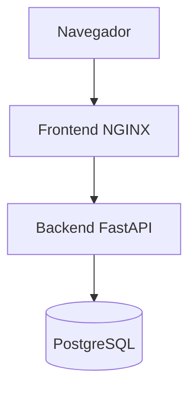
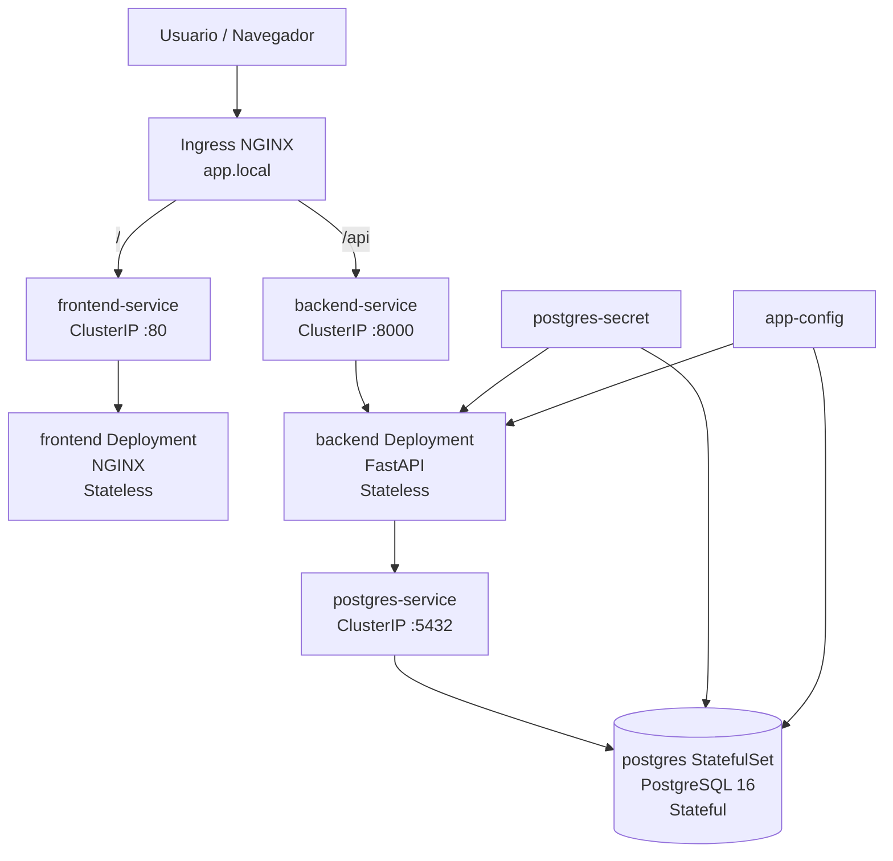

# Trabajo Práctico Grupal — Arquitectura de Software II

**Licenciatura en Informática — UNAHUR**
**Segundo cuatrimestre 2026**

---

## Índice

* [Descripción de la aplicación](#descripción-de-la-aplicación)
* [Arquitectura lógica](#arquitectura-lógica)
* [Arquitectura de despliegue en Kubernetes](#arquitectura-de-despliegue-en-kubernetes)
* [Clasificación de componentes](#clasificación-de-componentes)
* [Estructura del repositorio](#estructura-del-repositorio)
* [Recursos Kubernetes utilizados](#recursos-kubernetes-utilizados)
* [Prerrequisitos](#prerrequisitos)
* [Construcción de imágenes Docker](#construcción-de-imágenes-docker)
* [Despliegue en Minikube](#despliegue-en-minikube)
* [Verificación del Punto 1](#verificación-del-punto-1)
* [Configuración de Ingress](#configuración-de-ingress)
* [Configuración de hosts en Windows](#configuración-de-hosts-en-windows)
* [Uso de minikube tunnel en Windows](#uso-de-minikube-tunnel-en-windows)
* [Verificación del Punto 2](#verificación-del-punto-2)
* [Justificación de uso de Ingress](#justificación-de-uso-de-ingress)
* [Capturas de pantalla](#capturas-de-pantalla)
* [Estado actual](#estado-actual)

---

## Descripción de la aplicación

La aplicación elegida es un **gestor de tareas simple** compuesto por tres componentes principales:

| Componente    | Tecnología                          |
| ------------- | ----------------------------------- |
| Frontend      | HTML + JavaScript servido con NGINX |
| Backend       | API REST desarrollada con FastAPI   |
| Base de datos | PostgreSQL                          |

La aplicación permite consultar tareas existentes y crear nuevas tareas mediante una API REST.
Fue elegida porque representa una arquitectura web clásica de tres capas: presentación, lógica de negocio y persistencia.

El objetivo principal del trabajo práctico no es la complejidad funcional de la aplicación, sino el diseño, despliegue y operación de la infraestructura que la rodea.

---

## Arquitectura lógica



El frontend consume la API del backend mediante rutas bajo `/api`.
El backend se conecta a PostgreSQL utilizando una cadena de conexión configurada mediante un Secret de Kubernetes.

---

## Arquitectura de despliegue en Kubernetes



---

## Clasificación de componentes

| Componente | Tipo      | Recurso Kubernetes | Justificación                                                    |
| ---------- | --------- | ------------------ | ---------------------------------------------------------------- |
| Frontend   | Stateless | Deployment         | Sirve archivos estáticos mediante NGINX. No guarda estado local. |
| Backend    | Stateless | Deployment         | Procesa requests HTTP y delega la persistencia en PostgreSQL.    |
| PostgreSQL | Stateful  | StatefulSet        | Guarda datos persistentes y requiere almacenamiento estable.     |

---

## Estructura del repositorio

```txt
Arquitectura_2_CarpetaTP/
├── app/
│   ├── backend/
│   │   ├── Dockerfile
│   │   ├── main.py
│   │   ├── requirements.txt
│   │   └── .dockerignore
│   │
│   └── frontend/
│       ├── Dockerfile
│       ├── index.html
│       ├── nginx.conf
│       └── .dockerignore
│
├── manifests/
│   ├── 00-namespace.yaml
│   ├── 01-postgres-secret.yaml
│   ├── 02-app-configmap.yaml
│   ├── 03-postgres-statefulset.yaml
│   ├── 04-postgres-service.yaml
│   ├── 05-backend-deployment.yaml
│   ├── 06-backend-service.yaml
│   ├── 07-frontend-deployment.yaml
│   ├── 08-frontend-service.yaml
│   └── 09-ingress.yaml
│
├── docs/
│   └── screenshots/
│
├── observability/
├── .github/
│   └── workflows/
│
├── .gitignore
└── README.md
```

---

## Recursos Kubernetes utilizados

Los manifiestos se encuentran en la carpeta:

```txt
manifests/
```

### Namespace

Se creó un namespace propio para aislar los recursos del trabajo práctico:

```yaml
apiVersion: v1
kind: Namespace
metadata:
  name: arqsw2
```

---

### Secret

El archivo `01-postgres-secret.yaml` contiene configuración sensible:

```txt
POSTGRES_USER
POSTGRES_PASSWORD
DATABASE_URL
```

Las credenciales no se encuentran hardcodeadas en el código fuente ni dentro de las imágenes Docker.

---

### ConfigMap

El archivo `02-app-configmap.yaml` contiene configuración no sensible:

```txt
POSTGRES_DB
LOG_LEVEL
```

---

### StatefulSet

PostgreSQL se despliega mediante un `StatefulSet`, ya que es el único componente stateful de la arquitectura.

Archivo:

```txt
03-postgres-statefulset.yaml
```

---

### Services

Cada componente tiene un `Service` interno de tipo `ClusterIP`:

| Service          | Puerto | Uso                             |
| ---------------- | -----: | ------------------------------- |
| frontend-service |     80 | Expone internamente el frontend |
| backend-service  |   8000 | Expone internamente la API      |
| postgres-service |   5432 | Expone internamente PostgreSQL  |

---

### Deployments

El frontend y el backend se despliegan como `Deployment`.

| Deployment | Imagen               | Tipo      |
| ---------- | -------------------- | --------- |
| frontend   | tasks-frontend:local | Stateless |
| backend    | tasks-backend:local  | Stateless |

---

### Readiness Probe y Liveness Probe

El backend incluye probes sobre el endpoint:

```txt
/api/health
```

Estas probes permiten que Kubernetes verifique si el backend está listo para recibir tráfico y si debe reiniciarlo ante una falla.

Ejemplo:

```yaml
readinessProbe:
  httpGet:
    path: /api/health
    port: 8000
  initialDelaySeconds: 5
  periodSeconds: 10

livenessProbe:
  httpGet:
    path: /api/health
    port: 8000
  initialDelaySeconds: 15
  periodSeconds: 20
```

---

## Prerrequisitos

Para ejecutar el proyecto se requiere tener instalado:

* Docker Desktop
* kubectl
* Minikube
* Helm
* Git

Verificar versiones:

```powershell
docker --version
kubectl version --client
minikube version
helm version
git --version
```

---

## Iniciar Minikube

```powershell
minikube start --driver=docker
```

Verificar estado del cluster:

```powershell
minikube status
kubectl get nodes
```

Resultado esperado:

```txt
NAME       STATUS   ROLES           AGE   VERSION
minikube   Ready    control-plane   ...   ...
```

---

## Habilitar Ingress Controller

```powershell
minikube addons enable ingress
```

Verificar que el controller esté corriendo:

```powershell
kubectl get pods -n ingress-nginx
```

Resultado esperado:

```txt
ingress-nginx-controller-xxxxxxxxxx-xxxxx   1/1   Running
```

---

## Construcción de imágenes Docker

Para que Minikube pueda usar las imágenes locales sin subirlas a un registry externo, se configuró la terminal para construir directamente dentro del entorno Docker de Minikube:

```powershell
minikube -p minikube docker-env --shell powershell | Invoke-Expression
```

---

### Construir imagen del backend

```powershell
cd C:\Users\Windows\Desktop\Arquitectura_2_CarpetaTP\app\backend
docker build --no-cache -t tasks-backend:local .
```

---

### Construir imagen del frontend

```powershell
cd C:\Users\Windows\Desktop\Arquitectura_2_CarpetaTP\app\frontend
docker build --no-cache -t tasks-frontend:local .
```

---

## Despliegue en Minikube

Desde la raíz del proyecto:

```powershell
cd C:\Users\Windows\Desktop\Arquitectura_2_CarpetaTP
kubectl apply -f manifests/
```

Este comando aplica todos los manifiestos del directorio `manifests/`.

---

## Verificación del Punto 1

### Verificar pods

```powershell
kubectl get pods -n arqsw2
```

Resultado esperado:

```txt
NAME                        READY   STATUS    RESTARTS   AGE
backend-xxxxxxxxxx-xxxxx    1/1     Running   0          ...
frontend-xxxxxxxxxx-xxxxx   1/1     Running   0          ...
postgres-0                  1/1     Running   0          ...
```

---

### Verificar services

```powershell
kubectl get svc -n arqsw2
```

Resultado esperado:

```txt
NAME               TYPE        CLUSTER-IP      EXTERNAL-IP   PORT(S)
backend-service    ClusterIP   ...             <none>        8000/TCP
frontend-service   ClusterIP   ...             <none>        80/TCP
postgres-service   ClusterIP   ...             <none>        5432/TCP
```

---

### Verificar logs del backend

```powershell
kubectl logs deployment/backend -n arqsw2
```

Resultado esperado:

```txt
INFO:     Application startup complete.
INFO:     Uvicorn running on http://0.0.0.0:8000
INFO:     ... "GET /api/health HTTP/1.1" 200 OK
```

---

### Probar backend con port-forward

```powershell
kubectl port-forward service/backend-service 8000:8000 -n arqsw2
```

Abrir en el navegador:

```txt
http://127.0.0.1:8000/api/health
```

Resultado esperado:

```json
{"status":"ok","service":"backend-fastapi"}
```

Para cortar el port-forward:

```powershell
CTRL + C
```

---

### Probar frontend con port-forward

```powershell
kubectl port-forward service/frontend-service 8080:80 -n arqsw2
```

Abrir en el navegador:

```txt
http://127.0.0.1:8080
```

Para cortar el port-forward:

```powershell
CTRL + C
```

---

## Configuración de Ingress

Se configuró un Ingress NGINX para exponer frontend y backend bajo un mismo dominio local:

```txt
http://app.local/
http://app.local/api/
```

Archivo:

```txt
manifests/09-ingress.yaml
```

Reglas configuradas:

```txt
/      -> frontend-service:80
/api   -> backend-service:8000
```

Contenido del Ingress:

```yaml
apiVersion: networking.k8s.io/v1
kind: Ingress
metadata:
  name: app-ingress
  namespace: arqsw2
spec:
  ingressClassName: nginx
  rules:
    - host: app.local
      http:
        paths:
          - path: /api
            pathType: Prefix
            backend:
              service:
                name: backend-service
                port:
                  number: 8000
          - path: /
            pathType: Prefix
            backend:
              service:
                name: frontend-service
                port:
                  number: 80
```

---

## Configuración de hosts en Windows

En Windows se configuró el archivo:

```txt
C:\Windows\System32\drivers\etc\hosts
```

Con la siguiente entrada:

```txt
127.0.0.1 app.local
```

Para agregarla desde PowerShell como administrador:

```powershell
Add-Content -Path "C:\Windows\System32\drivers\etc\hosts" -Value "`n127.0.0.1 app.local"
```

Si ya existía una entrada previa con la IP de Minikube, se reemplazó por `127.0.0.1`:

```powershell
(Get-Content "C:\Windows\System32\drivers\etc\hosts") `
-replace "192\.168\.49\.2 app\.local", "127.0.0.1 app.local" |
Set-Content "C:\Windows\System32\drivers\etc\hosts"
```

Luego se limpió la caché DNS:

```powershell
ipconfig /flushdns
```

Resultado esperado:

```txt
Se vació correctamente la caché de resolución de DNS.
```

---

## Uso de minikube tunnel en Windows

En este entorno Windows, usando Minikube con Docker, fue necesario ejecutar:

```powershell
minikube tunnel
```

Este comando debe quedar corriendo en una terminal abierta para que `app.local` sea accesible desde el host.

Resultado esperado:

```txt
Tunnel successfully started
Starting tunnel for service app-ingress.
```

---

## Verificación del Punto 2

Con `minikube tunnel` activo, probar:

```powershell
curl.exe http://app.local/api/health
```

Resultado esperado:

```json
{"status":"ok","service":"backend-fastapi"}
```

También se puede probar:

```powershell
curl.exe http://app.local/api/tasks
```

Desde el navegador:

```txt
http://app.local/
http://app.local/api/health
http://app.local/api/tasks
http://app.local/api/docs
```

---

## Documentación Swagger de FastAPI

Para acceder a la documentación automática de FastAPI a través del Ingress se configuró la aplicación con:

```python
app = FastAPI(
    title="Gestor de Tareas API",
    description="Backend FastAPI para el TP grupal de Arquitectura de Software II",
    version="1.0.0",
    docs_url="/api/docs",
    openapi_url="/api/openapi.json"
)
```

De esta forma, la documentación queda disponible en:

```txt
http://app.local/api/docs
```

Y el esquema OpenAPI en:

```txt
http://app.local/api/openapi.json
```

No se utilizó `root_path="/api"` porque esa configuración provocaba errores `404` en el endpoint `/api/health`, utilizado por las probes de Kubernetes.

---

## Justificación de uso de Ingress

Se eligió Ingress porque permite centralizar el acceso HTTP a la aplicación mediante un único punto de entrada.

En lugar de exponer el frontend y el backend con servicios separados de tipo `NodePort`, Ingress permite usar un mismo dominio local y enrutar el tráfico según la ruta solicitada.

Esto permite acceder al frontend mediante `/` y a la API mediante `/api`, reproduciendo una forma de exposición más cercana a un entorno real de producción.

Además, Ingress facilita la futura incorporación de HTTPS mediante certificados TLS sobre el mismo dominio.

Esta decisión mejora la organización del acceso externo y evita depender de múltiples puertos expuestos manualmente.

---

## Capturas de pantalla

Las capturas se encuentran en:

```txt
docs/screenshots/
```

Capturas sugeridas:

| Archivo                     | Descripción                                 |
| --------------------------- | ------------------------------------------- |
| `01-pods-running.png`       | Pods corriendo en el namespace `arqsw2`     |
| `02-services.png`           | Services activos                            |
| `03-ingress.png`            | Ingress configurado                         |
| `04-api-health.png`         | Respuesta de `http://app.local/api/health`  |
| `05-frontend-app-local.png` | Frontend accedido desde `http://app.local/` |
| `06-fastapi-docs.png`       | Swagger UI en `http://app.local/api/docs`   |

Ejemplo de referencia en Markdown:

```md


```

---

## Estado actual

### Punto 1 — Kubernetes + Minikube

Estado: **completado**

* Frontend desplegado como `Deployment`.
* Backend desplegado como `Deployment`.
* PostgreSQL desplegado como `StatefulSet`.
* Configuración sensible almacenada en `Secret`.
* Configuración no sensible almacenada en `ConfigMap`.
* Services internos configurados.
* Readiness Probe y Liveness Probe configuradas en el backend.
* Aplicación completa corriendo en Minikube.

---

### Punto 2 — Ingress

Estado: **completado**

* Ingress NGINX configurado.
* Dominio local `app.local` configurado.
* Frontend accesible por `http://app.local/`.
* Backend accesible por `http://app.local/api/`.
* Documentación Swagger accesible por `http://app.local/api/docs`.
* En Windows se documenta el uso de `minikube tunnel`.

---

## Comandos útiles

Ver pods:

```powershell
kubectl get pods -n arqsw2
```

Ver services:

```powershell
kubectl get svc -n arqsw2
```

Ver Ingress:

```powershell
kubectl get ingress -n arqsw2
```

Ver logs del backend:

```powershell
kubectl logs deployment/backend -n arqsw2
```

Reiniciar backend:

```powershell
kubectl rollout restart deployment/backend -n arqsw2
```

Ver estado del rollout:

```powershell
kubectl rollout status deployment/backend -n arqsw2
```

Borrar todos los recursos del TP:

```powershell
kubectl delete namespace arqsw2
```
