# Trabajo Práctico Grupal — Arquitectura de Software II

**Licenciatura en Informática — UNAHUR**
**Segundo cuatrimestre 2026**

---

## Índice

* [Descripción de la aplicación](#descripción-de-la-aplicación)
* [Arquitectura lógica](#arquitectura-lógica)
* [Arquitectura de despliegue en Kubernetes](#arquitectura-de-despliegue-en-kubernetes)
* [Clasificación de componentes](#clasificación-de-componentes)
* [Estructura del repositorio](#estructura-del-repositorio)
* [Recursos Kubernetes utilizados](#recursos-kubernetes-utilizados)
* [Prerrequisitos](#prerrequisitos)

* [Punto 1 — Kubernetes + Minikube](#punto-1--kubernetes--minikube)
  * [Iniciar Minikube](#iniciar-minikube)
  * [Habilitar Ingress Controller](#habilitar-ingress-controller)
  * [Construcción de imágenes Docker](#construcción-de-imágenes-docker)
  * [Despliegue en Minikube](#despliegue-en-minikube)
  * [Verificación del Punto 1](#verificación-del-punto-1)

* [Punto 2 — Ingress](#punto-2--ingress)
  * [Configuración de Ingress](#configuración-de-ingress)
  * [Configuración de hosts en Windows](#configuración-de-hosts-en-windows)
  * [Uso de minikube tunnel en Windows](#uso-de-minikube-tunnel-en-windows)
  * [Verificación del Punto 2](#verificación-del-punto-2)
  * [Documentación Swagger de FastAPI](#documentación-swagger-de-fastapi)
  * [Justificación de uso de Ingress](#justificación-de-uso-de-ingress)
  * [Capturas de pantalla](#capturas-de-pantalla)

* [Punto 3 — HTTPS con cert-manager](#punto-3--https-con-cert-manager)
  * [Instalación de cert-manager](#instalación-de-cert-manager)
  * [Creación del Issuer self-signed](#creación-del-issuer-self-signed)
  * [Creación del certificado TLS](#creación-del-certificado-tls)
  * [Configuración TLS en el Ingress](#configuración-tls-en-el-ingress)
  * [Prueba de HTTPS](#prueba-de-https)
  * [Diferencia entre certificado self-signed y certificado firmado por una CA pública](#diferencia-entre-certificado-self-signed-y-certificado-firmado-por-una-ca-pública)
  * [Capturas de pantalla del Punto 3](#capturas-de-pantalla-del-punto-3)
* [Punto 4 — Observabilidad con Loki, Promtail, Prometheus y Grafana](#punto-4--observabilidad-con-loki-promtail-prometheus-y-grafana)
  * [Namespace de observabilidad](#namespace-de-observabilidad)
  * [Instalación de Loki](#instalación-de-loki)
  * [Instalación de Promtail](#instalación-de-promtail)
  * [Instalación de Grafana](#instalación-de-grafana)
  * [Configuración de Loki como datasource en Grafana](#configuración-de-loki-como-datasource-en-grafana)
  * [Consulta de logs en Grafana](#consulta-de-logs-en-grafana)
  * [Instalación de Prometheus](#instalación-de-prometheus)
  * [Configuración de Prometheus como datasource en Grafana](#configuración-de-prometheus-como-datasource-en-grafana)
  * [Consulta de métricas en Grafana](#consulta-de-métricas-en-grafana)
  * [Capturas de pantalla del Punto 4](#capturas-de-pantalla-del-punto-4)
* [Comandos útiles](#comandos-útiles)
---

## Descripción de la aplicación

La aplicación elegida es un **gestor de tareas simple** compuesto por tres componentes principales:

| Componente    | Tecnología                          |
| ------------- | ----------------------------------- |
| Frontend      | HTML + JavaScript servido con NGINX |
| Backend       | API REST desarrollada con FastAPI   |
| Base de datos | PostgreSQL                          |

La aplicación permite consultar tareas existentes y crear nuevas tareas mediante una API REST.
Fue elegida porque representa una arquitectura web clásica de tres capas: presentación, lógica de negocio y persistencia.

El objetivo principal del trabajo práctico no es la complejidad funcional de la aplicación, sino el diseño, despliegue y operación de la infraestructura que la rodea.

-----

## Arquitectura lógica

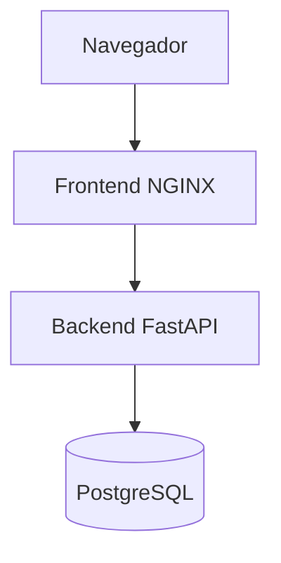
```mermaid
flowchart TD
    A[Navegador] --> B[Frontend NGINX]
    B --> C[Backend FastAPI]
    C --> D[(PostgreSQL)]
```

El frontend consume la API del backend mediante rutas bajo `/api`.
El backend se conecta a PostgreSQL utilizando una cadena de conexión configurada mediante un Secret de Kubernetes.

---

## Arquitectura de despliegue en Kubernetes

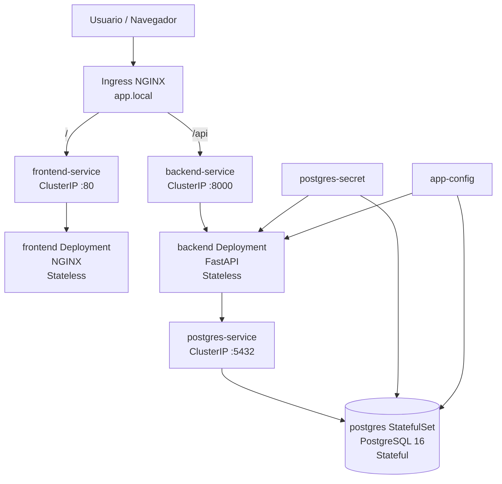
```mermaid
flowchart TD
    U[Usuario / Navegador] --> I[Ingress NGINX<br/>app.local]

    I -->|/| FS[frontend-service<br/>ClusterIP :80]
    I -->|/api| BS[backend-service<br/>ClusterIP :8000]

    FS --> FD[frontend Deployment<br/>NGINX<br/>Stateless]
    BS --> BD[backend Deployment<br/>FastAPI<br/>Stateless]

    BD --> PS[postgres-service<br/>ClusterIP :5432]
    PS --> PG[(postgres StatefulSet<br/>PostgreSQL 16<br/>Stateful)]

    SEC[postgres-secret] --> BD
    SEC --> PG

    CM[app-config] --> BD
    CM --> PG
```

---

## Clasificación de componentes

| Componente | Tipo      | Recurso Kubernetes | Justificación                                                    |
| ---------- | --------- | ------------------ | ---------------------------------------------------------------- |
| Frontend   | Stateless | Deployment         | Sirve archivos estáticos mediante NGINX. No guarda estado local. |
| Backend    | Stateless | Deployment         | Procesa requests HTTP y delega la persistencia en PostgreSQL.    |
| PostgreSQL | Stateful  | StatefulSet        | Guarda datos persistentes y requiere almacenamiento estable.     |

---

## Estructura del repositorio

```txt
Arquitectura_Software_2/
├── app/
│   ├── backend/
│   │   ├── Dockerfile
│   │   ├── main.py
│   │   ├── requirements.txt
│   │   └── .dockerignore
│   │
│   └── frontend/
│       ├── Dockerfile
│       ├── index.html
│       ├── nginx.conf
│       └── .dockerignore
│
├── manifests/
│   ├── 00-namespace.yaml
│   ├── 01-postgres-secret.yaml
│   ├── 02-app-configmap.yaml
│   ├── 03-postgres-statefulset.yaml
│   ├── 04-postgres-service.yaml
│   ├── 05-backend-deployment.yaml
│   ├── 06-backend-service.yaml
│   ├── 07-frontend-deployment.yaml
│   ├── 08-frontend-service.yaml
│   ├── 09-ingress.yaml
│   ├── 10-selfsigned-issuer.yaml
│   └── 11-certificate.yaml
│
├── docs/
│   └── screenshots/
│
├── observability/
├── .github/
│   └── workflows/
│
├── .gitignore
└── README.md
```

---

## Recursos Kubernetes utilizados

Los manifiestos se encuentran en la carpeta:

```txt
manifests/
```

### Namespace

Se creó un namespace propio para aislar los recursos del trabajo práctico:

```yaml
apiVersion: v1
kind: Namespace
metadata:
  name: arqsw2
```

---

### Secret

El archivo `01-postgres-secret.yaml` contiene configuración sensible:

```txt
POSTGRES_USER
POSTGRES_PASSWORD
DATABASE_URL
```

Las credenciales no se encuentran hardcodeadas en el código fuente ni dentro de las imágenes Docker.

---

### ConfigMap

El archivo `02-app-configmap.yaml` contiene configuración no sensible:

```txt
POSTGRES_DB
LOG_LEVEL
```

---

### StatefulSet

PostgreSQL se despliega mediante un `StatefulSet`, ya que es el único componente stateful de la arquitectura.

Archivo:

```txt
03-postgres-statefulset.yaml
```

---

### Services

Cada componente tiene un `Service` interno de tipo `ClusterIP`:

| Service          | Puerto | Uso                             |
| ---------------- | -----: | ------------------------------- |
| frontend-service |     80 | Expone internamente el frontend |
| backend-service  |   8000 | Expone internamente la API      |
| postgres-service |   5432 | Expone internamente PostgreSQL  |

---

### Deployments

El frontend y el backend se despliegan como `Deployment`.

| Deployment | Imagen               | Tipo      |
| ---------- | -------------------- | --------- |
| frontend   | tasks-frontend:local | Stateless |
| backend    | tasks-backend:local  | Stateless |

---

### Readiness Probe y Liveness Probe

El backend incluye probes sobre el endpoint:

```txt
/api/health
```

Estas probes permiten que Kubernetes verifique si el backend está listo para recibir tráfico y si debe reiniciarlo ante una falla.

Ejemplo:

```yaml
readinessProbe:
  httpGet:
    path: /api/health
    port: 8000
  initialDelaySeconds: 5
  periodSeconds: 10

livenessProbe:
  httpGet:
    path: /api/health
    port: 8000
  initialDelaySeconds: 15
  periodSeconds: 20
```

---

## Prerrequisitos

Para ejecutar el proyecto se requiere tener instalado:

* Docker Desktop
* kubectl
* Minikube
* Helm
* Git

Verificar versiones:

```powershell
docker --version
kubectl version --client
minikube version
helm version
git --version
```

### Instalación rápida con winget si algo te falta

| Herramienta | Comando de instalación |
|---|---|
| Docker Desktop | `winget install -e --id Docker.DockerDesktop` |
| kubectl | `winget install -e --id Kubernetes.kubectl` |
| Minikube | `winget install -e --id Kubernetes.minikube` |
| Helm | `winget install -e --id Helm.Helm` |
| Git | `winget install -e --id Git.Git` |

### Solución si Helm no se reconoce en PowerShell

| Problema | Causa probable | Solución |
|---|---|---|
| `helm : El término 'helm' no se reconoce...` | Helm quedó instalado, pero Windows no encuentra `helm.exe` en la variable de entorno `PATH`. | Agregar temporalmente la carpeta donde está `helm.exe` al `PATH` de la terminal actual. |

```powershell
$env:Path += ";C:\Users\Julian\AppData\Local\Microsoft\WinGet\Packages\Helm.Helm_Microsoft.Winget.Source_8wekyb3d8bbwe\windows-amd64"
helm version
```

> La ruta puede variar según el usuario de Windows. En este caso, el usuario era `Julian`.
---
## Punto 1 — Kubernetes + Minikube
### Iniciar Minikube

```powershell
minikube start --driver=docker
```

Verificar estado del cluster:

```powershell
minikube status
kubectl get nodes
```

Resultado esperado:

```txt
NAME       STATUS   ROLES           AGE   VERSION
minikube   Ready    control-plane   ...   ...
```

---

### Habilitar Ingress Controller

```powershell
minikube addons enable ingress
```

Verificar que el controller esté corriendo:

```powershell
kubectl get pods -n ingress-nginx
```

Resultado esperado:

```txt
ingress-nginx-controller-xxxxxxxxxx-xxxxx   1/1   Running
```

---

### Construcción de imágenes Docker

Para que Minikube pueda usar las imágenes locales sin subirlas a un registry externo, se configuró la terminal para construir directamente dentro del entorno Docker de Minikube:

```powershell
minikube -p minikube docker-env --shell powershell | Invoke-Expression
```

---

### Construir imagen del backend

```powershell
cd C:\Users\Windows\Desktop\Arquitectura_Software_2\app\backend
docker build --no-cache -t tasks-backend:local .
```

---

### Construir imagen del frontend

```powershell
cd C:\Users\Windows\Desktop\Arquitectura_Software_2\app\frontend
docker build --no-cache -t tasks-frontend:local .
```

---

### Despliegue en Minikube

Desde la raíz del proyecto:

```powershell
cd C:\Users\Windows\Desktop\Arquitectura_Software_2
kubectl apply -f manifests/
```

Este comando aplica todos los manifiestos del directorio `manifests/`.

---

### Verificación del Punto 1

### Verificar pods

```powershell
kubectl get pods -n arqsw2
```

Resultado esperado:

```txt
NAME                        READY   STATUS    RESTARTS   AGE
backend-xxxxxxxxxx-xxxxx    1/1     Running   0          ...
frontend-xxxxxxxxxx-xxxxx   1/1     Running   0          ...
postgres-0                  1/1     Running   0          ...
```

---

### Verificar services

```powershell
kubectl get svc -n arqsw2
```

Resultado esperado:

```txt
NAME               TYPE        CLUSTER-IP      EXTERNAL-IP   PORT(S)
backend-service    ClusterIP   ...             <none>        8000/TCP
frontend-service   ClusterIP   ...             <none>        80/TCP
postgres-service   ClusterIP   ...             <none>        5432/TCP
```

---

### Verificar logs del backend

```powershell
kubectl logs deployment/backend -n arqsw2
```

Resultado esperado:

```txt
INFO:     Application startup complete.
INFO:     Uvicorn running on http://0.0.0.0:8000
INFO:     ... "GET /api/health HTTP/1.1" 200 OK
```

---

### Probar backend con port-forward

```powershell
kubectl port-forward service/backend-service 8000:8000 -n arqsw2
```

Abrir en el navegador:

```txt
http://127.0.0.1:8000/api/health
```

Resultado esperado:

```json
{"status":"ok","service":"backend-fastapi"}
```

Para cortar el port-forward:

```powershell
CTRL + C
```

---

### Probar frontend con port-forward

```powershell
kubectl port-forward service/frontend-service 8080:80 -n arqsw2
```

Abrir en el navegador:

```txt
http://127.0.0.1:8080
```

Para cortar el port-forward:

```powershell
CTRL + C
```

---
## Punto 2 — Ingress
### Configuración de Ingress

Se configuró un Ingress NGINX para exponer frontend y backend bajo un mismo dominio local:

```txt
http://app.local/
http://app.local/api/
```

Archivo:

```txt
manifests/09-ingress.yaml
```

Reglas configuradas:

```txt
/      -> frontend-service:80
/api   -> backend-service:8000
```

Contenido inicial del Ingress, antes de agregar TLS:

```yaml
apiVersion: networking.k8s.io/v1
kind: Ingress
metadata:
  name: app-ingress
  namespace: arqsw2
spec:
  ingressClassName: nginx
  rules:
    - host: app.local
      http:
        paths:
          - path: /api
            pathType: Prefix
            backend:
              service:
                name: backend-service
                port:
                  number: 8000
          - path: /
            pathType: Prefix
            backend:
              service:
                name: frontend-service
                port:
                  number: 80
```

---

### Configuración de hosts en Windows

En Windows se configuró el archivo:

```txt
C:\Windows\System32\drivers\etc\hosts
```

Con la siguiente entrada:

```txt
127.0.0.1 app.local
```

Para agregarla desde PowerShell como administrador:

```powershell
Add-Content -Path "C:\Windows\System32\drivers\etc\hosts" -Value "`n127.0.0.1 app.local"
```

Si ya existía una entrada previa con la IP de Minikube, se reemplazó por `127.0.0.1`:

```powershell
(Get-Content "C:\Windows\System32\drivers\etc\hosts") `
-replace "192\.168\.49\.2 app\.local", "127.0.0.1 app.local" |
Set-Content "C:\Windows\System32\drivers\etc\hosts"
```

Luego se limpió la caché DNS:

```powershell
ipconfig /flushdns
```

Resultado esperado:

```txt
Se vació correctamente la caché de resolución de DNS.
```

---

### Uso de minikube tunnel en Windows

En este entorno Windows, usando Minikube con Docker, fue necesario ejecutar:

```powershell
minikube tunnel
```

Este comando debe quedar corriendo en una terminal abierta para que `app.local` sea accesible desde el host.

Resultado esperado:

```txt
Tunnel successfully started
Starting tunnel for service app-ingress.
```

---

### Verificación del Punto 2

Con `minikube tunnel` activo, probar:

```powershell
curl.exe http://app.local/api/health
```

Resultado esperado:

```json
{"status":"ok","service":"backend-fastapi"}
```

También se puede probar:

```powershell
curl.exe http://app.local/api/tasks
```

Desde el navegador:

```txt
http://app.local/
http://app.local/api/health
http://app.local/api/tasks
http://app.local/api/docs
```

---

### Documentación Swagger de FastAPI

Para acceder a la documentación automática de FastAPI a través del Ingress se configuró la aplicación con:

```python
app = FastAPI(
    title="Gestor de Tareas API",
    description="Backend FastAPI para el TP grupal de Arquitectura de Software II",
    version="1.0.0",
    docs_url="/api/docs",
    openapi_url="/api/openapi.json"
)
```

De esta forma, la documentación queda disponible en:

```txt
http://app.local/api/docs
```

Y el esquema OpenAPI en:

```txt
http://app.local/api/openapi.json
```

No se utilizó `root_path="/api"` porque esa configuración provocaba errores `404` en el endpoint `/api/health`, utilizado por las probes de Kubernetes.

---

### Justificación de uso de Ingress

Se eligió Ingress porque permite centralizar el acceso HTTP a la aplicación mediante un único punto de entrada.

En lugar de exponer el frontend y el backend con servicios separados de tipo `NodePort`, Ingress permite usar un mismo dominio local y enrutar el tráfico según la ruta solicitada.

Esto permite acceder al frontend mediante `/` y a la API mediante `/api`, reproduciendo una forma de exposición más cercana a un entorno real de producción.

Además, Ingress facilita la futura incorporación de HTTPS mediante certificados TLS sobre el mismo dominio.

Esta decisión mejora la organización del acceso externo y evita depender de múltiples puertos expuestos manualmente.

---

### Capturas de pantalla

Las capturas se encuentran en la carpeta:

`docs/screenshots/`

| Captura | Descripción |
|---|---|
| `01-pods-running.png` | Pods corriendo en el namespace `arqsw2` |
| `02-services.png` | Services activos |
| `03-ingress.png` | Ingress configurado |
| `04-api-health.png` | Respuesta de `http://app.local/api/health` |
| `05-frontend-app-local.png` | Frontend accedido desde `http://app.local/` |
| `06-fastapi-docs.png` | Swagger UI en `http://app.local/api/docs` |

### Pods corriendo

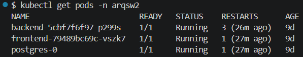

### Services activos

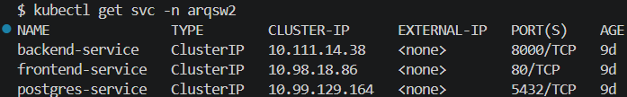

### Ingress configurado

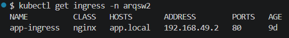

### API Health

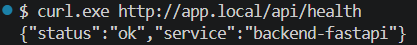

### Frontend en app.local

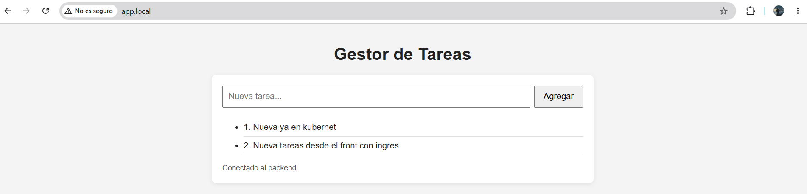

### FastAPI Docs

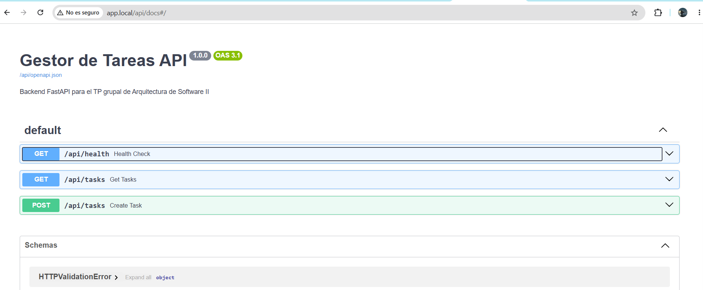

---

## Punto 3 — HTTPS con cert-manager

Para completar la exposición segura de la aplicación, se configuró HTTPS sobre el Ingress utilizando `cert-manager` y un certificado self-signed para el dominio local:

```txt
https://app.local/
https://app.local/api/
```

El objetivo de este punto fue agregar TLS al Ingress, permitiendo acceder tanto al frontend como al backend mediante HTTPS.

---

### Instalación de cert-manager

Se instaló `cert-manager` en el cluster de Kubernetes aplicando el manifiesto oficial:

```powershell
kubectl apply -f https://github.com/cert-manager/cert-manager/releases/latest/download/cert-manager.yaml
```

Luego se verificó que los pods de cert-manager quedaran corriendo correctamente:

```powershell
kubectl get pods -n cert-manager
```

Resultado esperado:

```txt
cert-manager-xxxxx              1/1   Running
cert-manager-cainjector-xxxxx   1/1   Running
cert-manager-webhook-xxxxx      1/1   Running
```

---

### Creación del Issuer self-signed

Se creó un `Issuer` de tipo self-signed dentro del namespace `arqsw2`.

Archivo:

```txt
manifests/10-selfsigned-issuer.yaml
```

Contenido:

```yaml
apiVersion: cert-manager.io/v1
kind: Issuer
metadata:
  name: selfsigned-issuer
  namespace: arqsw2
spec:
  selfSigned: {}
```

Aplicar el manifiesto:

```powershell
kubectl apply -f manifests/10-selfsigned-issuer.yaml
```

Verificar el Issuer:

```powershell
kubectl get issuer -n arqsw2
```

Resultado esperado:

```txt
NAME                READY   AGE
selfsigned-issuer   True    ...
```

---

### Creación del certificado TLS

Luego se creó un recurso `Certificate` para el dominio `app.local`.

Archivo:

```txt
manifests/11-certificate.yaml
```

Contenido:

```yaml
apiVersion: cert-manager.io/v1
kind: Certificate
metadata:
  name: app-local-certificate
  namespace: arqsw2
spec:
  secretName: app-local-tls
  issuerRef:
    name: selfsigned-issuer
    kind: Issuer
  dnsNames:
    - app.local
```

Aplicar el manifiesto:

```powershell
kubectl apply -f manifests/11-certificate.yaml
```

Verificar el certificado:

```powershell
kubectl get certificate -n arqsw2
```

Resultado esperado:

```txt
NAME                    READY   SECRET          AGE
app-local-certificate   True    app-local-tls   ...
```

También se verificó que cert-manager generara el Secret TLS correspondiente:

```powershell
kubectl get secret app-local-tls -n arqsw2
```

Resultado esperado:

```txt
NAME            TYPE                DATA   AGE
app-local-tls   kubernetes.io/tls   3      ...
```

---

### Configuración TLS en el Ingress

Se modificó el Ingress para asociarlo al Secret TLS generado por cert-manager.

Archivo:

```txt
manifests/09-ingress.yaml
```

Contenido final del Ingress:

```yaml
apiVersion: networking.k8s.io/v1
kind: Ingress
metadata:
  name: app-ingress
  namespace: arqsw2
spec:
  ingressClassName: nginx
  tls:
    - hosts:
        - app.local
      secretName: app-local-tls
  rules:
    - host: app.local
      http:
        paths:
          - path: /api
            pathType: Prefix
            backend:
              service:
                name: backend-service
                port:
                  number: 8000
          - path: /
            pathType: Prefix
            backend:
              service:
                name: frontend-service
                port:
                  number: 80
```

Aplicar el Ingress actualizado:

```powershell
kubectl apply -f manifests/09-ingress.yaml
```

Verificar el Ingress:

```powershell
kubectl get ingress -n arqsw2
```

Resultado esperado:

```txt
NAME          CLASS   HOSTS       ADDRESS     PORTS     AGE
app-ingress   nginx   app.local   localhost   80, 443   ...
```

---

### Prueba de HTTPS

Para acceder a `app.local` desde Windows se debe mantener abierto `minikube tunnel` en una terminal:

```powershell
minikube tunnel
```

Luego se probó el endpoint de salud del backend usando HTTPS:

```powershell
curl.exe -k https://app.local/api/health
```

Se utiliza `-k` porque el certificado es self-signed y no está firmado por una autoridad certificante pública reconocida por el sistema operativo.

Resultado esperado:

```json
{"status":"ok","service":"backend-fastapi"}
```

También se verificó el acceso desde el navegador:

```txt
https://app.local/
```

Al ingresar desde el navegador aparece una advertencia de seguridad. Esto es esperable porque el certificado es self-signed. Para continuar, se debe ingresar en las opciones avanzadas del navegador y aceptar el acceso al sitio.

También se puede probar:

```txt
https://app.local/api/health
https://app.local/api/docs
```

---

### Diferencia entre certificado self-signed y certificado firmado por una CA pública

Un certificado self-signed es un certificado firmado por la misma entidad que lo emite. En este trabajo práctico se utilizó este tipo de certificado porque el dominio `app.local` es local y no existe públicamente en Internet. Este enfoque sirve para pruebas, laboratorios y entornos de desarrollo, ya que permite habilitar HTTPS sin depender de una autoridad certificante externa. Sin embargo, los navegadores no confían automáticamente en certificados self-signed, por eso muestran una advertencia de seguridad al ingresar al sitio. En un entorno productivo real, se utilizaría un certificado firmado por una CA pública, como Let’s Encrypt u otra autoridad certificante reconocida, para que los navegadores confíen automáticamente en el sitio y no muestren advertencias.

---

### Capturas de pantalla del Punto 3

Las capturas correspondientes al Punto 3 se encuentran en:

```txt
docs/screenshots/
```

| Archivo                    | Descripción                                                                   |
| -------------------------- | ----------------------------------------------------------------------------- |
| `07-cert-manager-pods.png` | Pods de cert-manager corriendo correctamente                                  |
| `08-selfsigned-issuer.png` | Issuer self-signed creado y en estado Ready                                   |
| `09-certificate-ready.png` | Certificate en estado Ready, Secret TLS creado e Ingress con puertos 80 y 443 |
| `10-https-health.png`      | Respuesta exitosa de `https://app.local/api/health` usando HTTPS              |
| `11-https-frontend.png`    | Frontend accesible desde `https://app.local/`                                 |

### cert-manager instalado

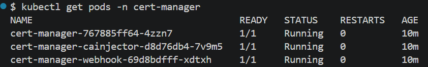

### Issuer self-signed

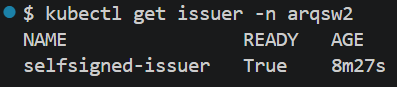

### Certificate, Secret TLS e Ingress

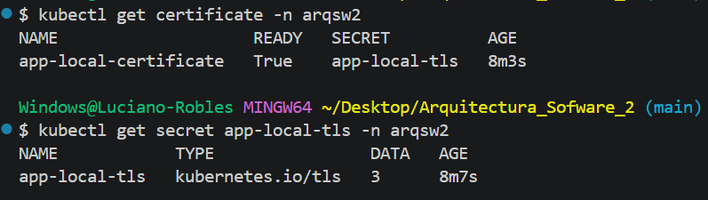

### API Health por HTTPS

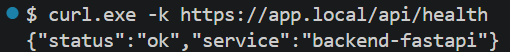

### Frontend por HTTPS

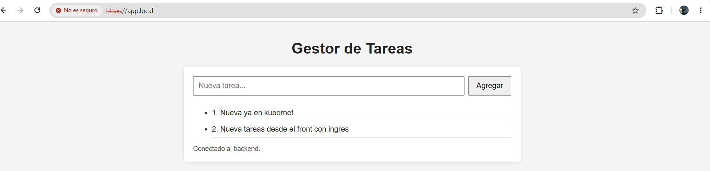

---
## Punto 4 — Observabilidad con Loki, Promtail, Prometheus y Grafana

Para incorporar observabilidad a la aplicación desplegada en Kubernetes, se configuraron herramientas para centralizar logs y visualizar métricas del cluster.

La solución utilizada fue:

| Herramienta | Función |
|---|---|
| Loki | Almacenamiento y consulta de logs |
| Promtail | Recolección de logs desde los pods |
| Grafana | Visualización de logs y métricas |
| Prometheus | Recolección y consulta de métricas del cluster |

El objetivo de este punto fue poder observar el comportamiento de la aplicación y del entorno Kubernetes desde una interfaz centralizada.

---

### Namespace de observabilidad

Se creó un namespace separado para aislar los recursos de observabilidad:

```powershell
kubectl create namespace observability
```

Verificación:

```powershell
kubectl get ns
```

---

### Instalación de Loki

Primero se agregó el repositorio Helm de Grafana:

```powershell
helm repo add grafana https://grafana.github.io/helm-charts
helm repo update
```

Para instalar Loki en Minikube se creó un archivo de valores personalizado, ya que se utilizó una configuración local con almacenamiento en filesystem.

Archivo:

```txt
observability/loki-values.yaml
```

Contenido:

```yaml
deploymentMode: SingleBinary

loki:
  auth_enabled: false

  commonConfig:
    replication_factor: 1

  schemaConfig:
    configs:
      - from: "2024-01-01"
        store: tsdb
        object_store: filesystem
        schema: v13
        index:
          prefix: loki_index_
          period: 24h

  storage:
    type: filesystem

singleBinary:
  replicas: 1

read:
  replicas: 0

write:
  replicas: 0

backend:
  replicas: 0

gateway:
  enabled: false
```

Luego se instaló Loki con Helm:

```powershell
helm install loki grafana/loki `
  --namespace observability `
  -f observability\loki-values.yaml
```

Verificación:

```powershell
kubectl get pods -n observability
kubectl get svc -n observability
```

Resultado esperado:

```txt
loki-0   1/1   Running
```

---

### Instalación de Promtail

Promtail se encarga de recolectar los logs de los pods y enviarlos a Loki.

```powershell
helm install promtail grafana/promtail `
  --namespace observability `
  --set config.clients[0].url=http://loki:3100/loki/api/v1/push
```

Verificación:

```powershell
kubectl get pods -n observability
```

Resultado esperado:

```txt
promtail-xxxxx   1/1   Running
```

---

### Instalación de Grafana

Grafana se instaló para visualizar logs y métricas desde una interfaz web.

```powershell
helm install grafana grafana/grafana `
  --namespace observability `
  --set adminPassword=admin `
  --set service.type=ClusterIP
```

Verificación:

```powershell
kubectl get pods -n observability
```

Resultado esperado:

```txt
grafana-xxxxxxxxxx-xxxxx   1/1   Running
```

Para acceder a Grafana se utilizó port-forward:

```powershell
kubectl port-forward service/grafana 3000:80 -n observability
```

Luego se ingresó desde el navegador a:

```txt
http://localhost:3000
```

Credenciales utilizadas:

```txt
Usuario: admin
Contraseña: admin
```

---

### Configuración de Loki como datasource en Grafana

Dentro de Grafana se agregó Loki como fuente de datos.

Ruta dentro de Grafana:

```txt
Connections → Data sources → Add data source → Loki
```

URL configurada:

```txt
http://loki:3100
```

Luego se seleccionó:

```txt
Save & test
```

Con esto Grafana quedó conectado a Loki para consultar los logs recolectados por Promtail.

---

### Consulta de logs en Grafana

Para consultar logs se ingresó a:

```txt
Grafana → Explore
```

Se seleccionó el datasource:

```txt
Loki
```

Consulta para logs del backend:

```logql
{namespace="arqsw2", app="backend"}
```

Consulta para logs del frontend:

```logql
{namespace="arqsw2", app="frontend"}
```

Consulta para logs de PostgreSQL:

```logql
{namespace="arqsw2", app="postgres"}
```

Para generar tráfico y validar que aparecieran nuevos logs, se ejecutaron requests contra la API:

```powershell
curl.exe -k https://app.local/api/health
curl.exe -k https://app.local/api/tasks
curl.exe -k https://app.local/api/docs
```

---

### Instalación de Prometheus

Para incorporar métricas del cluster se agregó el repositorio Helm de Prometheus Community:

```powershell
helm repo add prometheus-community https://prometheus-community.github.io/helm-charts
helm repo update
```

Luego se instaló `kube-prometheus-stack` en el namespace `observability`:

```powershell
helm install prometheus prometheus-community/kube-prometheus-stack `
  --namespace observability `
  --set grafana.enabled=false
```

Se deshabilitó Grafana dentro del chart de Prometheus porque ya se había instalado una instancia de Grafana previamente.

Verificación:

```powershell
kubectl get pods -n observability
```

Resultado esperado:

```txt
prometheus-xxxxx
alertmanager-xxxxx
kube-state-metrics-xxxxx
node-exporter-xxxxx
prometheus-operator-xxxxx
```

---

### Configuración de Prometheus como datasource en Grafana

Primero se verificaron los services disponibles:

```powershell
kubectl get svc -n observability
```

Luego, dentro de Grafana, se agregó Prometheus como fuente de datos.

Ruta dentro de Grafana:

```txt
Connections → Data sources → Add data source → Prometheus
```

URL configurada:

```txt
http://prometheus-kube-prometheus-prometheus:9090
```

Luego se seleccionó:

```txt
Save & test
```

Con esto Grafana quedó conectado a Prometheus para consultar métricas del cluster.

---

### Consulta de métricas en Grafana

Para consultar métricas se ingresó a:

```txt
Grafana → Explore
```

Se seleccionó el datasource:

```txt
Prometheus
```

Se probaron consultas simples en PromQL.

Consulta para verificar targets activos:

```promql
up
```

Consulta para ver el estado de los pods:

```promql
kube_pod_status_phase
```

Consulta para ver métricas de CPU de contenedores:

```promql
container_cpu_usage_seconds_total
```

Estas consultas permiten validar que Prometheus está recolectando métricas del cluster y que Grafana puede consultarlas correctamente.

---

### Capturas de pantalla del Punto 4

Las capturas correspondientes al Punto 4 se encuentran en:

```txt
docs/screenshots/
```

| Archivo | Descripción |
|---|---|
| `12-observability-pods.png` | Pods de observabilidad corriendo en el namespace `observability` |
| `13-grafana-loki-datasource.png` | Loki configurado como datasource en Grafana |
| `14-grafana-backend-logs.png` | Logs del backend consultados desde Grafana Explore |
| `15-prometheus-datasource.png` | Prometheus configurado como datasource en Grafana |
| `16-grafana-metrics.png` | Consulta PromQL funcionando desde Grafana Explore |

### Pods de observabilidad

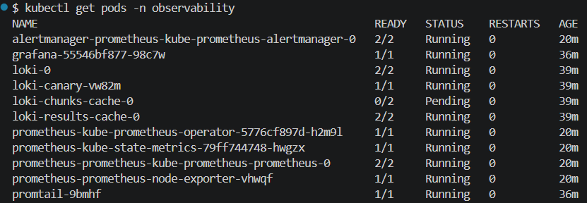

### Loki datasource

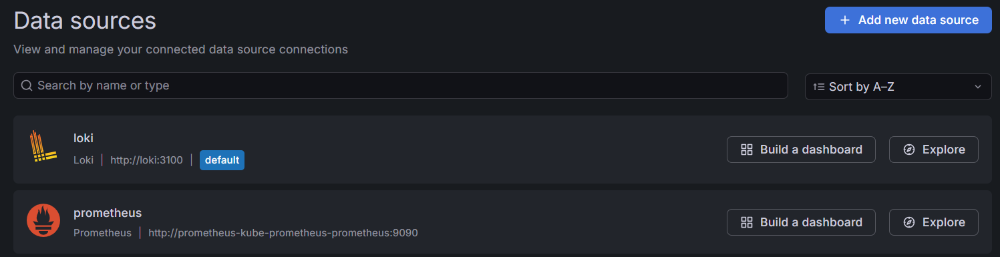

### Logs del backend en Grafana

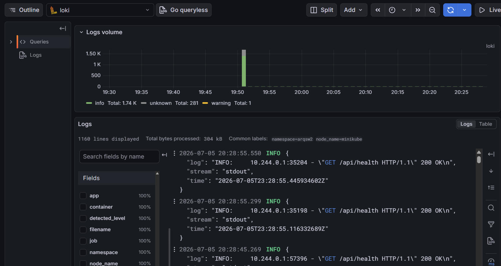

### Prometheus datasource


### Métricas en Grafana

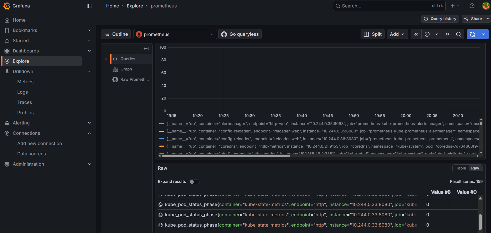

---

## Punto 5 — CI/CD e Infraestructura como Código

El objetivo de este punto fue incorporar automatización al ciclo de vida del proyecto y documentar una estrategia de infraestructura como código (IaC) para llevar este sistema a un entorno más cercano a producción.

### Pipeline CI/CD

Se implementó un pipeline con GitHub Actions para validar automáticamente el proyecto ante cada push o pull request sobre la rama principal.

El pipeline incluye los siguientes stages:

- Build: instalación de dependencias y preparación del entorno del backend.
- Test: ejecución de un test simple para comprobar que el módulo de la aplicación puede importarse correctamente.
- Análisis estático de seguridad: validación del código Python mediante Bandit.
- Deploy validation: verificación sintáctica de los manifiestos de Kubernetes con `kubectl apply --dry-run=client`.

El objetivo de este stage no es desplegar el sistema en un cluster real desde GitHub Actions, sino validar que los artefactos y los manifiestos son correctos.

### Infraestructura como Código y verificación de NFR

Se documentó una propuesta breve de IaC y de verificación de requisitos no funcionales (NFR) para un entorno de producción.

La propuesta cubre:

- Qué herramienta de IaC se usaría para gestionar el entorno en producción y por qué.
- Cómo verificar al menos dos NFR críticos, por ejemplo disponibilidad, tiempo de respuesta y seguridad.
- Un esquema general de arquitectura objetivo en un proveedor cloud, reemplazando los componentes del cluster local por servicios managed.

### Implementación realizada

Se agregó un workflow de GitHub Actions en:

```txt
.github/workflows/ci.yml
```

Este workflow se ejecuta automáticamente al hacer push o pull request sobre la rama principal y valida:

```txt
- instalación de dependencias del backend
- ejecución de un test simple
- análisis estático con Bandit
- validación de los manifiestos de Kubernetes
```

### Cómo probar el Punto 5

#### Opción 1: probarlo localmente

```powershell
python -m pip install --upgrade pip
pip install -r app/backend/requirements.txt
pip install bandit
python -m pytest -q app/backend
bandit -r app/backend -q
kubectl apply --dry-run=client -f manifests/
```

#### Opción 2: probarlo desde GitHub Actions

1. Subir los cambios al repositorio:

```powershell
git add .
git commit -m "Agregar punto 5 CI/CD"
git push
```

2. Ingresar a la pestaña "Actions" de GitHub.
3. Verificar que el workflow se ejecute correctamente.
4. Guardar el log o captura de la ejecución como evidencia del punto 5.


## Comandos útiles

Ver pods:

```powershell
kubectl get pods -n arqsw2
```

Ver services:

```powershell
kubectl get svc -n arqsw2
```

Ver Ingress:

```powershell
kubectl get ingress -n arqsw2
```

Ver logs del backend:

```powershell
kubectl logs deployment/backend -n arqsw2
```

Reiniciar backend:

```powershell
kubectl rollout restart deployment/backend -n arqsw2
```

Ver estado del rollout:

```powershell
kubectl rollout status deployment/backend -n arqsw2
```

Borrar todos los recursos del TP:

```powershell
kubectl delete namespace arqsw2
```
